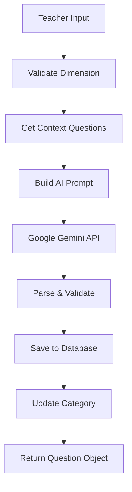

# 🎓 Quiz API Backend with AI Question Generation

A FastAPI-based backend system for educational quizzes with integrated AI question generation using Google Gemini.

## 🚀 Quick Start

### Prerequisites
- Python 3.10+
- Conda environment
- Google Gemini API key
- Firebase credentials

### Setup & Run
```bash
cd "c:\Users\ahmed\Desktop\Stage Esprit\Stage\Deployments\Backend"

# Activate conda environment
conda activate ./.conda

# Start the server
python -m uvicorn src.main:app --reload --host 0.0.0.0 --port 8000
```

### Access Points
- **API Server**: http://localhost:8000
- **Swagger Documentation**: http://localhost:8000/docs
- **ReDoc**: http://localhost:8000/redoc

## 🏗️ Architecture

### Core Components
- **FastAPI**: Modern web framework for building APIs
- **Firebase**: NoSQL database for data persistence
- **Google Gemini**: AI model for question generation
- **Sentence Transformers**: Semantic search and embeddings
- **FAISS**: Vector similarity search

### Database Collections
- `questions` - Generated and manual questions
- `quizzes` - Quiz metadata and configuration
- `categories` - Question categories and subcategories
- `answers` - Student responses
- `scores` - Assessment results

## 🤖 AI Question Generation System

### Overview
The system uses Google Gemini AI with Retrieval-Augmented Generation (RAG) to create contextually appropriate 5-point Likert scale questions.

### Features
- ✅ **Dimension-Specific Generation**: Tailored prompts for creativity, soft skills, teamwork, etc.
- ✅ **Custom Subdimensions**: Teachers can create new subcategories not in the dataset
- ✅ **Smart Context Retrieval**: Uses semantic search for relevant examples
- ✅ **Proper Model Integration**: Generates valid Question objects with correct IDs
- ✅ **Auto-Category Updates**: Automatically adds new subdimensions to categories

### Generation Flow


### Supported Dimensions
- **Creativity**: Innovation problem solving, algorithm design, UX design, system architecture
- **Soft Skills**: Time management, critical thinking, adaptability, presentation communication
- **Teamwork**: Communication documentation, code review collaboration, conflict resolution, leadership mentoring, agile participation
- **Hard Skills**: Programming languages, database management, DevOps deployment, testing QA

## 📡 API Endpoints

### Questions
- `GET /questions/` - List all questions
- `POST /questions/` - Create a new question
- `GET /questions/{id}` - Get specific question
- `PUT /questions/{id}` - Update question
- `DELETE /questions/{id}` - Delete question
- `GET /questions/by_quiz/{quiz_id}` - Get questions by quiz
- `GET /questions/search/?keyword={keyword}` - Search questions

### AI Generation
- `GET /questions/dimensions` - Get available dimensions
- `GET /questions/subdimensions/{dimension}` - Get subdimensions for dimension
- `POST /questions/generate` - Generate AI question

#### Generation Request Format (Simplified)
```json
{
  "idQuiz": "actual_quiz_id_from_database",
  "idCategory": "actual_category_id_from_database", 
  "subdimension": "optional_custom_subdimension",
  "target_year_level": 2
}
```

**Auto-Detection Features:**
- **Dimension**: Automatically pulled from category's `island` field
- **Subdimension**: Uses provided subdimension OR auto-selects from category OR falls back to dataset
- **Quiz/Category Validation**: Verifies IDs exist in database before generation

#### Generation Response Format
```json
{
  "question": {
    "idQuestion": "auto_generated_firebase_id",
    "content": "I am confident in my ability to solve problems creatively.",
    "idQuiz": "actual_quiz_id_from_database",
    "idCategory": "actual_category_id_from_database"
  },
  "generation_metadata": {
    "dimension": "creativity",
    "subdimension": "innovation_problem_solving",
    "target_year_level": 2,
    "response_scale": "1-5"
  }
}
```

**🔗 Schema Integration:**
- Generated questions use your existing `Question` schema exactly
- Questions are automatically saved to your Firebase `questions` collection
- All relationships (`idQuiz`, `idCategory`) are maintained properly
- Generated questions work with your existing quiz display and answer collection systems

## 🅰️ Angular Frontend Integration

### Why Create a Quiz API Service?

The **Quiz API Service** acts as a centralized communication layer between your Angular frontend and the FastAPI backend. Instead of making HTTP requests directly in components, the service provides:

- **Type Safety**: TypeScript interfaces ensure proper request/response handling
- **Reusability**: Multiple components can use the same service methods
- **Maintainability**: API URL changes only need updates in one place
- **Error Handling**: Centralized error management and retry logic
- **Abstraction**: Components focus on UI logic, not HTTP details

### LLM Integration with Existing Schemas

The AI question generation system is **fully integrated** with your existing database schemas:

- **Questions Generated** → Automatically saved as `Question` objects in Firebase
- **Quiz Relationships** → Generated questions are properly linked to existing quizzes via `idQuiz`
- **Category Connections** → Questions maintain `idCategory` relationships for proper organization
- **Automatic ID Generation** → Firebase assigns proper `idQuestion` IDs to all generated questions
- **Schema Validation** → All generated questions follow your existing `Question` model structure

**This means**: Generated questions work seamlessly with your existing question management, quiz display, and answer collection systems.

### Frontend Integration Examples Explained

The examples demonstrate **different integration patterns** for various use cases:

1. **Complete Quiz Generator**: Full-featured component for teachers to generate entire quizzes
2. **Single Question Generator**: Simple form for generating one question at a time  
3. **Dimension Explorer**: Discovery tool to explore available dimensions and subdimensions

Each example shows how to:
- Handle different generation scenarios (complete quiz vs single question vs custom subdimensions)
- Manage loading states during AI generation (which takes 10-30 seconds)
- Display results and handle errors appropriately
- Integrate with your existing quiz and category data

### Setup Angular Service

#### 1. Install HTTP Client
```bash
ng add @angular/common/http
```

#### 2. Create Quiz API Service
```typescript
// services/quiz-api.service.ts
import { Injectable } from '@angular/core';
import { HttpClient, HttpParams } from '@angular/common/http';
import { Observable } from 'rxjs';

export interface QuestionGenerateRequest {
  idQuiz: string;
  idCategory: string;
  subdimension?: string;
  target_year_level: number;
}

export interface Question {
  idQuestion: string;
  content: string;
  idQuiz: string;
  idCategory: string;
}

export interface GenerationResponse {
  question: Question;
  generation_metadata: {
    dimension: string;
    subdimension: string;
    target_year_level: number;
    response_scale: string;
  };
}

@Injectable({
  providedIn: 'root'
})
export class QuizApiService {
  private baseUrl = 'http://localhost:8000';

  constructor(private http: HttpClient) {}

  // Dimension & Subdimension Discovery
  getDimensions(): Observable<{dimensions: string[]}> {
    return this.http.get<{dimensions: string[]}>(`${this.baseUrl}/questions/dimensions`);
  }

  getSubdimensions(dimension: string): Observable<{subdimensions: string[]}> {
    return this.http.get<{subdimensions: string[]}>(`${this.baseUrl}/questions/subdimensions/${dimension}`);
  }

  // Question Generation
  generateQuestion(request: QuestionGenerateRequest): Observable<GenerationResponse> {
    return this.http.post<GenerationResponse>(`${this.baseUrl}/questions/generate`, request);
  }

  // Quiz Management
  getQuizzes(): Observable<any[]> {
    return this.http.get<any[]>(`${this.baseUrl}/quizzes/`);
  }

  createQuiz(quiz: any): Observable<any> {
    return this.http.post<any>(`${this.baseUrl}/quizzes/`, quiz);
  }

  // Category Management
  getCategories(): Observable<any[]> {
    return this.http.get<any[]>(`${this.baseUrl}/categories/`);
  }

  createCategory(category: any): Observable<any> {
    return this.http.post<any>(`${this.baseUrl}/categories/`, category);
  }

  // Question Retrieval
  getQuestionsByQuiz(quizId: string): Observable<Question[]> {
    return this.http.get<Question[]>(`${this.baseUrl}/questions/by_quiz/${quizId}`);
  }
}
```

### Frontend Integration Examples

#### 1. Generate Complete Quiz Component
```typescript
// components/quiz-generator.component.ts
import { Component, OnInit } from '@angular/core';
import { QuizApiService, QuestionGenerateRequest } from '../services/quiz-api.service';

@Component({
  selector: 'app-quiz-generator',
  template: `
    <div class="quiz-generator">
      <h2>🎯 AI Quiz Generator</h2>
      
      <!-- Quiz Setup -->
      <div class="setup-section">
        <select [(ngModel)]="selectedQuiz" (change)="onQuizChange()">
          <option value="">Select Quiz</option>
          <option *ngFor="let quiz of quizzes" [value]="quiz.idQuiz">
            {{quiz.nameQuiz}}
          </option>
        </select>

        <select [(ngModel)]="selectedCategory">
          <option value="">Select Category</option>
          <option *ngFor="let category of categories" [value]="category.idCategory">
            {{category.island}} ({{category.subcategories?.length || 0}} subdimensions)
          </option>
        </select>

        <input type="number" [(ngModel)]="yearLevel" placeholder="Year Level (1-3)" min="1" max="3">
      </div>

      <!-- Generation Options -->
      <div class="generation-options">
        <h3>Generation Strategy</h3>
        
        <label>
          <input type="radio" [(ngModel)]="generationMode" value="complete-quiz">
          Complete Quiz (All Subdimensions)
        </label>
        
        <label>
          <input type="radio" [(ngModel)]="generationMode" value="single-dimension">
          Single Dimension Only
        </label>
        
        <label>
          <input type="radio" [(ngModel)]="generationMode" value="custom-subdimensions">
          Custom Subdimensions
        </label>

        <!-- Subdimension Selection -->
        <div *ngIf="generationMode === 'single-dimension' && availableSubdimensions.length > 0">
          <select [(ngModel)]="selectedSubdimension">
            <option value="">Auto-detect from category</option>
            <option *ngFor="let sub of availableSubdimensions" [value]="sub">{{sub}}</option>
          </select>
        </div>

        <!-- Custom Subdimensions -->
        <div *ngIf="generationMode === 'custom-subdimensions'">
          <div *ngFor="let custom of customSubdimensions; let i = index">
            <input [(ngModel)]="customSubdimensions[i]" placeholder="Enter custom subdimension">
            <button (click)="removeCustomSubdimension(i)">Remove</button>
          </div>
          <button (click)="addCustomSubdimension()">+ Add Custom Subdimension</button>
        </div>

        <input type="number" [(ngModel)]="questionsPerSubdimension" placeholder="Questions per subdimension" min="1" max="5">
      </div>

      <!-- Generate Button -->
      <button 
        (click)="generateQuestions()" 
        [disabled]="!canGenerate()"
        class="generate-btn">
        🤖 Generate {{getTotalQuestionsCount()}} Questions
      </button>

      <!-- Progress -->
      <div *ngIf="isGenerating" class="progress">
        <div class="progress-bar" [style.width.%]="generationProgress"></div>
        <p>{{generationStatus}}</p>
      </div>

      <!-- Results -->
      <div *ngIf="generatedQuestions.length > 0" class="results">
        <h3>✅ Generated {{generatedQuestions.length}} Questions</h3>
        <div *ngFor="let q of generatedQuestions; let i = index" class="question-item">
          <strong>{{i + 1}}. {{q.metadata.subdimension}}</strong>
          <p>"{{q.question.content}}"</p>
          <small>Dimension: {{q.metadata.dimension}} | Level: {{q.metadata.target_year_level}}</small>
        </div>
      </div>
    </div>
  `
})
export class QuizGeneratorComponent implements OnInit {
  quizzes: any[] = [];
  categories: any[] = [];
  availableSubdimensions: string[] = [];
  
  selectedQuiz = '';
  selectedCategory = '';
  selectedSubdimension = '';
  yearLevel = 2;
  questionsPerSubdimension = 2;
  
  generationMode = 'complete-quiz';
  customSubdimensions: string[] = [''];
  
  isGenerating = false;
  generationProgress = 0;
  generationStatus = '';
  generatedQuestions: any[] = [];

  constructor(private quizApi: QuizApiService) {}

  ngOnInit() {
    this.loadQuizzes();
    this.loadCategories();
  }

  loadQuizzes() {
    this.quizApi.getQuizzes().subscribe(quizzes => {
      this.quizzes = quizzes;
    });
  }

  loadCategories() {
    this.quizApi.getCategories().subscribe(categories => {
      this.categories = categories;
    });
  }

  onQuizChange() {
    // Reset selections when quiz changes
    this.selectedCategory = '';
    this.availableSubdimensions = [];
  }

  onCategoryChange() {
    if (this.selectedCategory) {
      // Get the category details
      const category = this.categories.find(c => c.idCategory === this.selectedCategory);
      if (category && category.island) {
        // Load subdimensions for this dimension
        this.quizApi.getSubdimensions(category.island).subscribe(response => {
          this.availableSubdimensions = response.subdimensions;
        });
      }
    }
  }

  addCustomSubdimension() {
    this.customSubdimensions.push('');
  }

  removeCustomSubdimension(index: number) {
    this.customSubdimensions.splice(index, 1);
  }

  canGenerate(): boolean {
    return !!(this.selectedQuiz && this.selectedCategory && this.yearLevel && !this.isGenerating);
  }

  getTotalQuestionsCount(): number {
    if (this.generationMode === 'complete-quiz') {
      return this.availableSubdimensions.length * this.questionsPerSubdimension;
    } else if (this.generationMode === 'single-dimension') {
      return this.questionsPerSubdimension;
    } else if (this.generationMode === 'custom-subdimensions') {
      return this.customSubdimensions.filter(sub => sub.trim()).length * this.questionsPerSubdimension;
    }
    return 0;
  }

  async generateQuestions() {
    this.isGenerating = true;
    this.generationProgress = 0;
    this.generatedQuestions = [];

    let subdimensionsToGenerate: string[] = [];

    if (this.generationMode === 'complete-quiz') {
      subdimensionsToGenerate = this.availableSubdimensions;
    } else if (this.generationMode === 'single-dimension') {
      subdimensionsToGenerate = this.selectedSubdimension ? [this.selectedSubdimension] : [''];
    } else if (this.generationMode === 'custom-subdimensions') {
      subdimensionsToGenerate = this.customSubdimensions.filter(sub => sub.trim());
    }

    const totalRequests = subdimensionsToGenerate.length * this.questionsPerSubdimension;
    let completedRequests = 0;

    for (const subdimension of subdimensionsToGenerate) {
      this.generationStatus = `Generating questions for: ${subdimension || 'auto-detected'}`;
      
      for (let i = 0; i < this.questionsPerSubdimension; i++) {
        const request: QuestionGenerateRequest = {
          idQuiz: this.selectedQuiz,
          idCategory: this.selectedCategory,
          target_year_level: this.yearLevel
        };

        if (subdimension) {
          request.subdimension = subdimension;
        }

        try {
          const response = await this.quizApi.generateQuestion(request).toPromise();
          this.generatedQuestions.push(response);
        } catch (error) {
          console.error('Generation failed:', error);
        }

        completedRequests++;
        this.generationProgress = (completedRequests / totalRequests) * 100;
      }

      // Small delay between subdimensions
      await new Promise(resolve => setTimeout(resolve, 1000));
    }

    this.isGenerating = false;
    this.generationStatus = `✅ Generated ${this.generatedQuestions.length} questions!`;
  }
}
```

#### 2. Single Question Generator Component
```typescript
// components/single-question-generator.component.ts
@Component({
  selector: 'app-single-question-generator',
  template: `
    <div class="single-question-generator">
      <h3>🎯 Generate Single Question</h3>
      
      <form (ngSubmit)="generateQuestion()" #questionForm="ngForm">
        <!-- Quiz Selection -->
        <div class="form-group">
          <label>Quiz:</label>
          <select [(ngModel)]="request.idQuiz" name="quiz" required>
            <option value="">Select Quiz</option>
            <option *ngFor="let quiz of quizzes" [value]="quiz.idQuiz">
              {{quiz.nameQuiz}}
            </option>
          </select>
        </div>

        <!-- Category Selection -->
        <div class="form-group">
          <label>Category:</label>
          <select [(ngModel)]="request.idCategory" name="category" required (change)="onCategoryChange()">
            <option value="">Select Category</option>
            <option *ngFor="let category of categories" [value]="category.idCategory">
              {{category.island}} ({{category.subcategories?.join(', ')}})
            </option>
          </select>
        </div>

        <!-- Subdimension Selection -->
        <div class="form-group">
          <label>Subdimension (Optional):</label>
          <select [(ngModel)]="request.subdimension" name="subdimension">
            <option value="">Auto-detect from category</option>
            <option *ngFor="let sub of availableSubdimensions" [value]="sub">{{sub}}</option>
          </select>
          <input 
            type="text" 
            [(ngModel)]="customSubdimension" 
            name="customSub"
            placeholder="Or enter custom subdimension"
            (input)="onCustomSubdimensionChange()">
        </div>

        <!-- Year Level -->
        <div class="form-group">
          <label>Complexity Level:</label>
          <select [(ngModel)]="request.target_year_level" name="yearLevel" required>
            <option value="1">Year 1 (Simple)</option>
            <option value="2">Year 2 (Intermediate)</option>
            <option value="3">Year 3 (Advanced)</option>
          </select>
        </div>

        <button type="submit" [disabled]="!questionForm.form.valid || isGenerating">
          {{isGenerating ? '🔄 Generating...' : '🤖 Generate Question'}}
        </button>
      </form>

      <!-- Generated Question Display -->
      <div *ngIf="lastGeneratedQuestion" class="generated-question">
        <h4>✅ Generated Question:</h4>
        <div class="question-card">
          <p class="question-text">"{{lastGeneratedQuestion.question.content}}"</p>
          <div class="metadata">
            <span class="badge">{{lastGeneratedQuestion.generation_metadata.dimension}}</span>
            <span class="badge">{{lastGeneratedQuestion.generation_metadata.subdimension}}</span>
            <span class="badge">Level {{lastGeneratedQuestion.generation_metadata.target_year_level}}</span>
          </div>
          <p class="question-id">ID: {{lastGeneratedQuestion.question.idQuestion}}</p>
        </div>
      </div>
    </div>
  `
})
export class SingleQuestionGeneratorComponent implements OnInit {
  request: QuestionGenerateRequest = {
    idQuiz: '',
    idCategory: '',
    target_year_level: 2
  };

  quizzes: any[] = [];
  categories: any[] = [];
  availableSubdimensions: string[] = [];
  customSubdimension = '';
  
  isGenerating = false;
  lastGeneratedQuestion: any = null;

  constructor(private quizApi: QuizApiService) {}

  ngOnInit() {
    this.loadQuizzes();
    this.loadCategories();
  }

  loadQuizzes() {
    this.quizApi.getQuizzes().subscribe(quizzes => {
      this.quizzes = quizzes;
    });
  }

  loadCategories() {
    this.quizApi.getCategories().subscribe(categories => {
      this.categories = categories;
    });
  }

  onCategoryChange() {
    if (this.request.idCategory) {
      const category = this.categories.find(c => c.idCategory === this.request.idCategory);
      if (category && category.island) {
        this.quizApi.getSubdimensions(category.island).subscribe(response => {
          this.availableSubdimensions = response.subdimensions;
        });
      }
    }
  }

  onCustomSubdimensionChange() {
    if (this.customSubdimension.trim()) {
      this.request.subdimension = this.customSubdimension.trim();
    }
  }

  generateQuestion() {
    this.isGenerating = true;
    
    this.quizApi.generateQuestion(this.request).subscribe({
      next: (response) => {
        this.lastGeneratedQuestion = response;
        this.isGenerating = false;
      },
      error: (error) => {
        console.error('Generation failed:', error);
        this.isGenerating = false;
      }
    });
  }
}
```

#### 3. Dimension Explorer Component
```typescript
// components/dimension-explorer.component.ts
@Component({
  selector: 'app-dimension-explorer',
  template: `
    <div class="dimension-explorer">
      <h3>🗺️ Explore Available Dimensions</h3>
      
      <div class="dimensions-grid">
        <div *ngFor="let dimension of dimensions" class="dimension-card" (click)="selectDimension(dimension)">
          <h4>{{dimension}}</h4>
          <button (click)="loadSubdimensions(dimension); $event.stopPropagation()">
            View Subdimensions
          </button>
        </div>
      </div>

      <!-- Selected Dimension Details -->
      <div *ngIf="selectedDimension" class="dimension-details">
        <h4>📋 {{selectedDimension}} Subdimensions</h4>
        <div class="subdimensions-list">
          <span *ngFor="let sub of selectedSubdimensions" class="subdimension-badge">
            {{sub}}
          </span>
        </div>
        
        <div class="quick-actions">
          <button (click)="generateSampleQuestion(selectedDimension)">
            🔬 Generate Sample Question
          </button>
        </div>
      </div>

      <!-- Sample Question -->
      <div *ngIf="sampleQuestion" class="sample-question">
        <h5>💡 Sample Question for {{selectedDimension}}:</h5>
        <p>"{{sampleQuestion.question.content}}"</p>
        <small>Subdimension: {{sampleQuestion.generation_metadata.subdimension}}</small>
      </div>
    </div>
  `
})
export class DimensionExplorerComponent implements OnInit {
  dimensions: string[] = [];
  selectedDimension = '';
  selectedSubdimensions: string[] = [];
  sampleQuestion: any = null;

  constructor(private quizApi: QuizApiService) {}

  ngOnInit() {
    this.loadDimensions();
  }

  loadDimensions() {
    this.quizApi.getDimensions().subscribe(response => {
      this.dimensions = response.dimensions;
    });
  }

  selectDimension(dimension: string) {
    this.selectedDimension = dimension;
    this.loadSubdimensions(dimension);
  }

  loadSubdimensions(dimension: string) {
    this.quizApi.getSubdimensions(dimension).subscribe(response => {
      this.selectedSubdimensions = response.subdimensions;
    });
  }

  generateSampleQuestion(dimension: string) {
    // This would need a sample quiz and category ID - you'd typically get these from your app state
    const sampleRequest: QuestionGenerateRequest = {
      idQuiz: 'sample_quiz_id',
      idCategory: 'sample_category_id',
      target_year_level: 2
    };

    this.quizApi.generateQuestion(sampleRequest).subscribe(response => {
      this.sampleQuestion = response;
    });
  }
}
```

### Common Usage Scenarios

#### 🎯 Scenario 1: Generate Complete Quiz
```typescript
// Generate a complete quiz covering all subdimensions in a category
async generateCompleteQuiz(quizId: string, categoryId: string, questionsPerSub: number = 2) {
  // 1. Get the category to find its dimension
  const category = await this.quizApi.getCategories().toPromise()
    .then(cats => cats.find(c => c.idCategory === categoryId));
  
  // 2. Get all subdimensions for this dimension
  const subdimensions = await this.quizApi.getSubdimensions(category.island).toPromise();
  
  // 3. Generate questions for each subdimension
  const allQuestions = [];
  for (const subdimension of subdimensions.subdimensions) {
    for (let i = 0; i < questionsPerSub; i++) {
      const question = await this.quizApi.generateQuestion({
        idQuiz: quizId,
        idCategory: categoryId,
        subdimension: subdimension,
        target_year_level: 2
      }).toPromise();
      allQuestions.push(question);
    }
  }
  
  return allQuestions;
}
```

#### 🎯 Scenario 2: Generate Questions for Specific Dimension
```typescript
// Focus on one specific dimension with multiple questions
async generateForDimension(quizId: string, categoryId: string, targetSubdimensions: string[]) {
  const questions = [];
  
  for (const subdimension of targetSubdimensions) {
    const question = await this.quizApi.generateQuestion({
      idQuiz: quizId,
      idCategory: categoryId,
      subdimension: subdimension,
      target_year_level: 2
    }).toPromise();
    questions.push(question);
  }
  
  return questions;
}

// Usage:
// this.generateForDimension(quizId, categoryId, ['innovation_problem_solving', 'artistic_expression'])
```

#### 🎯 Scenario 3: Custom Teacher-Defined Subdimensions
```typescript
// Teachers can create their own subdimensions not in the dataset
async generateCustomSubdimensions(quizId: string, categoryId: string, customSubs: string[]) {
  const questions = [];
  
  for (const customSubdimension of customSubs) {
    // The API will automatically add these to the category
    const question = await this.quizApi.generateQuestion({
      idQuiz: quizId,
      idCategory: categoryId,
      subdimension: customSubdimension, // e.g., "musical_creativity", "digital_art"
      target_year_level: 2
    }).toPromise();
    questions.push(question);
  }
  
  return questions;
}

// Usage:
// this.generateCustomSubdimensions(quizId, categoryId, ['musical_creativity', 'digital_storytelling'])
```

#### 🎯 Scenario 4: Progressive Difficulty Quiz
```typescript
// Generate questions with increasing difficulty levels
async generateProgressiveQuiz(quizId: string, categoryId: string) {
  const questions = [];
  const subdimensions = ['innovation_problem_solving', 'artistic_expression'];
  
  // Year 1 - Basic questions
  for (const sub of subdimensions) {
    const q1 = await this.quizApi.generateQuestion({
      idQuiz: quizId,
      idCategory: categoryId,
      subdimension: sub,
      target_year_level: 1
    }).toPromise();
    questions.push({...q1, difficulty: 'Basic'});
  }
  
  // Year 2 - Intermediate questions  
  for (const sub of subdimensions) {
    const q2 = await this.quizApi.generateQuestion({
      idQuiz: quizId,
      idCategory: categoryId,
      subdimension: sub,
      target_year_level: 2
    }).toPromise();
    questions.push({...q2, difficulty: 'Intermediate'});
  }
  
  // Year 3 - Advanced questions
  for (const sub of subdimensions) {
    const q3 = await this.quizApi.generateQuestion({
      idQuiz: quizId,
      idCategory: categoryId,
      subdimension: sub,
      target_year_level: 3
    }).toPromise();
    questions.push({...q3, difficulty: 'Advanced'});
  }
  
  return questions;
}
```

#### 🎯 Scenario 5: Smart Auto-Detection
```typescript
// Let the system auto-detect everything from the category
async generateWithAutoDetection(quizId: string, categoryId: string, count: number = 5) {
  const questions = [];
  
  for (let i = 0; i < count; i++) {
    // No subdimension specified - system will auto-detect from category
    const question = await this.quizApi.generateQuestion({
      idQuiz: quizId,
      idCategory: categoryId,
      // subdimension: omitted for auto-detection
      target_year_level: Math.floor(Math.random() * 3) + 1 // Random difficulty
    }).toPromise();
    questions.push(question);
  }
  
  return questions;
}
```

### Error Handling & Best Practices

#### Robust Error Handling
```typescript
async generateWithErrorHandling(request: QuestionGenerateRequest) {
  try {
    const response = await this.quizApi.generateQuestion(request).toPromise();
    return { success: true, question: response };
  } catch (error) {
    if (error.status === 404) {
      return { success: false, error: 'Quiz or Category not found' };
    } else if (error.status === 400) {
      return { success: false, error: 'Invalid request parameters' };
    } else if (error.status === 500) {
      return { success: false, error: 'AI generation service temporarily unavailable' };
    } else {
      return { success: false, error: 'Network error - please try again' };
    }
  }
}
```

#### Rate Limiting & Optimization
```typescript
// Implement delays between requests to avoid overwhelming the AI service
class QuestionGeneratorService {
  private requestQueue: Promise<any> = Promise.resolve();
  
  async generateQuestionWithRateLimit(request: QuestionGenerateRequest): Promise<any> {
    // Chain requests with delays
    this.requestQueue = this.requestQueue
      .then(() => this.quizApi.generateQuestion(request).toPromise())
      .then(result => {
        // 1 second delay between requests
        return new Promise(resolve => setTimeout(() => resolve(result), 1000));
      });
    
    return this.requestQueue;
  }
}
```

### Other Endpoints

### Categories
- `GET /categories/` - List all categories
- `POST /categories/` - Create a new category
- `GET /categories/{id}` - Get specific category
- `PUT /categories/{id}` - Update category
- `DELETE /categories/{id}` - Delete category

**Category Schema:**
```json
{
  "island": "creativity",
  "subcategories": ["innovation_problem_solving", "artistic_expression"]
}
```

### Quizzes
- `GET /quizzes/` - List all quizzes
- `POST /quizzes/` - Create a new quiz
- `GET /quizzes/{id}` - Get specific quiz
- `PUT /quizzes/{id}` - Update quiz
- `DELETE /quizzes/{id}` - Delete quiz

**Quiz Schema:**
```json
{
  "idTeacher": "teacher_001",
  "idCategory": ["cat1", "cat2", "cat3", "cat4"],
  "dateCreation": "2025-01-27T10:30:00",
  "isAccessible": true,
  "accessCode": "QUIZ123",
  "nameQuiz": "Creativity Assessment Quiz"
}
```

### Answers & Scores
- `GET /answers/` - List all answers
- `POST /answers/` - Submit an answer
- `GET /answers/by_quiz/{quiz_id}` - Get answers for a quiz
- `GET /scores/` - List all scores
- `POST /scores/` - Calculate and save scores

## 🔧 Configuration

### Environment Variables
```env
GEMINI_API_KEY=your_google_gemini_api_key
FIREBASE_CREDENTIALS=path_to_firebase_credentials.json
```

### Dataset Requirements
The system expects a questions dataset at:
```
../../Datasets/Quiz Generation/questions.csv
```

## 🧪 Testing

### Run Comprehensive Test
```bash
python test_comprehensive.py
```

### Test Individual Endpoints
```bash
# Get dimensions
curl -X GET "http://localhost:8000/questions/dimensions"

# Get subdimensions
curl -X GET "http://localhost:8000/questions/subdimensions/creativity"

# Generate question
curl -X POST "http://localhost:8000/questions/generate" \
  -H "Content-Type: application/json" \
  -d '{
    "idQuiz": "your_quiz_id",
    "idCategory": "your_category_id",
    "target_year_level": 2
  }'
```

##  Common Issues
- **CORS errors**: Ensure backend is running with proper CORS configuration
- **Generation timeouts**: AI generation takes 10-30 seconds, implement loading states
- **Invalid IDs**: Always validate quiz/category IDs exist before generating questions

## 📝 License
This project is part of the Stage Esprit internship program.

---
*Built with ❤️ using FastAPI, Google Gemini AI, Firebase, and Angular*